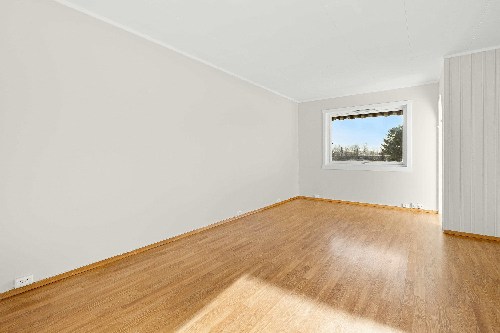
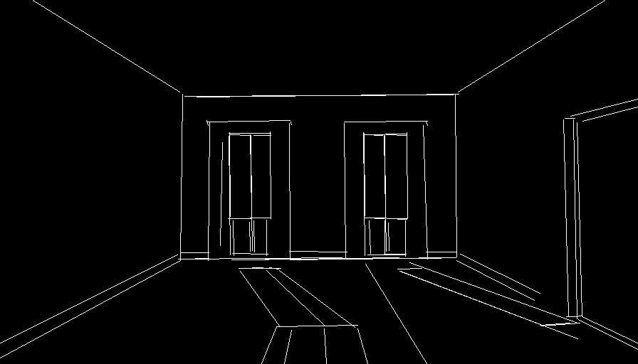
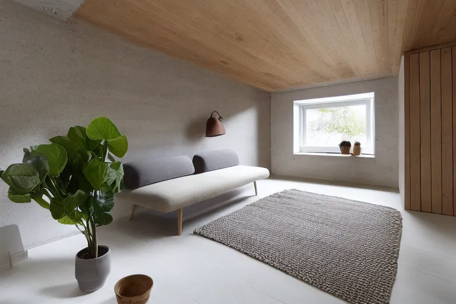

# 🏡 AI Interior Architect

A Generative AI prototype for real estate and interior design. This tool takes a photo of an empty room, analyzes its geometry, and instantly generates a photorealistic, fully furnished rendering based on a text prompt.

## 📸 Before & After

| Empty Room (Input) | Room Skeleton | Furnished Room (Output) |
| :---: | :---: | :---: |
|  |  | 

*Example Prompt*: "A bright and airy Scandinavian living room interior, filled with abundant natural daylight streaming through large windows. White painted walls and light oak hardwood floor covered by a soft textured wool rug. A comfortable grey fabric sofa with clean lines, paired with a warm brown leather armchair and a minimalist pale wood coffee table. Decorative elements include a chunky knit throw blanket, linen curtains, potted green plants (Monstera, Fiddle Leaf Fig), minimalist abstract wall art, stacked design books, and simple ceramic vases. Lit candles provide a cozy atmosphere. High detailed, photorealistic, 8k resolution, architectural photography, soft natural light, volumetric daylight, cinematic lighting, hygge aesthetic"

## ✨ Key Features
* **Structural Preservation:** Uses ControlNet (MLSD) to detect and preserve the original walls, floors, and windows.
* **Custom Styles:** Type any interior design style (Modern, Industrial, Victorian, etc.) to dynamically change the room's look.
* **Local Execution:** Optimized to run entirely on local hardware ensuring data privacy (tested on AMD RX 6600).
* **Simple UI:** A clean, browser-based interface powered by Gradio.

## 🚀 Quick Start

This project uses `uv` for lightning-fast dependency management.

1. Clone the repository:
   git clone https://github.com/MicheleMeazzini/ai-interior-designer.git
   cd ai-interior-designer

2. Run the application (dependencies will auto-install):
   uv run src/app.py

3. Open the provided local URL (e.g., http://127.0.0.1:7860) in your web browser.

## 🛠️ Tech Stack
* **UI:** Gradio
* **Core Generation:** Stable Diffusion v1.5
* **Spatial Conditioning:** ControlNet (MLSD)
* **Environment:** Python & `uv`